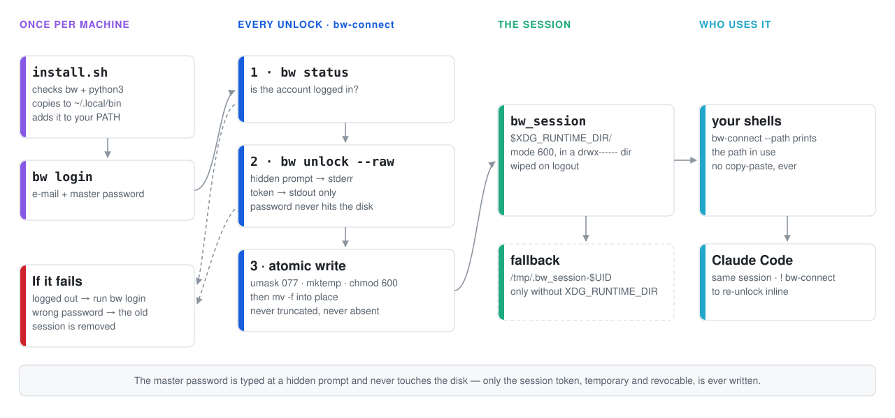
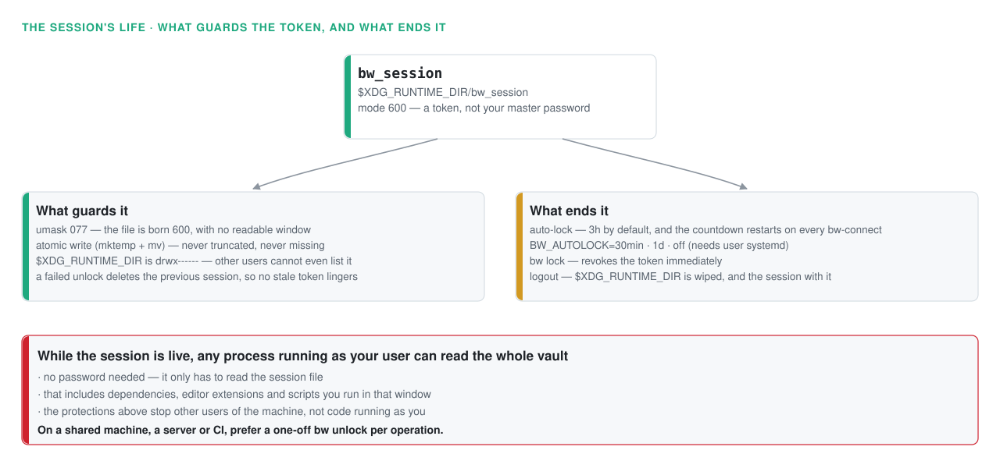

# bw-connect

**English** · [Português](README.pt-BR.md)

Unlock your [Bitwarden](https://bitwarden.com/) vault from the terminal with a single command and leave the session ready to use — by you, by your scripts and by [Claude Code](https://claude.com/claude-code).

No copy/pasting tokens, no password in your shell history, no secret written to disk.

```console
$ bw-connect
? Master password: [hidden]
✅ Bitwarden conectado
   Sessão:    /run/user/1000/bw_session
   Auto-lock: em 3h
```

> ℹ️ The script's own messages are in Portuguese. This README quotes them verbatim so that what you see in the terminal matches what you read here.

## Table of contents

- [What it solves](#-what-it-solves)
- [How it works](#-how-it-works)
- [What's in this repository](#-whats-in-this-repository)
- [Prerequisites](#-prerequisites)
- [Installation](#-installation)
- [Day-to-day use](#-day-to-day-use)
- [Use with Claude Code](#-use-with-claude-code)
- [Security](#-security)
- [Troubleshooting](#-troubleshooting)
- [Uninstalling](#-uninstalling)

## 🎯 What it solves

The stock Bitwarden CLI flow is awkward:

```bash
# Without bw-connect 😩
bw unlock
# → prints an export BW_SESSION="…huge token…" for you
#   to copy and paste by hand into every terminal
```

`bw-connect` turns that into a single command: it unlocks the vault, captures the session token via `--raw` and writes it to your runtime directory with `600` permissions. Any process of yours (other terminals, scripts, Claude Code) then uses that same session.

## ⚙️ How it works

<picture>
  <source media="(prefers-color-scheme: dark)" srcset="docs/img/bwflow-dark.svg">
  
</picture>

Step by step through the script ([`bw-connect`](bw-connect)):

1. **Checks the login** — `bw status`; if the account is logged out, it tells you to run `bw login` first
2. **Unlocks** — `bw unlock --raw` asks for the master password at a **hidden** prompt (the prompt goes to stderr; stdout carries only the token). The previous session stays valid while you type, and is discarded only if the unlock fails — so a stale token never lingers pretending to be the current session
3. **Persists the session** — writes the token atomically (temp file + `mv`) under `umask 077`, so the file is born restricted, never exists in a truncated state, and is never missing during the swap

The master password **never** touches the disk and never appears in any output. Only the session token (temporary and revocable) is written.

### Where the session lives

The file goes to `$XDG_RUNTIME_DIR/bw_session` — a per-user private directory (`drwx------`) that the system wipes automatically on logout. On systems without `XDG_RUNTIME_DIR` (macOS, some containers), the script falls back to `/tmp/.bw_session-$UID`.

You never need to memorize the path: `bw-connect --path` prints the one in use.

## 📦 What's in this repository

| File | What it is |
|---|---|
| [`bw-connect`](bw-connect) | The script itself |
| [`install.sh`](install.sh) | Automated installer |
| `README.md` | This guide |

**This repository contains NO password, token or secret whatsoever.** All authentication happens at use time, on the target machine.

## ✅ Prerequisites

| Dependency | What for | How to install |
|---|---|---|
| [Bitwarden CLI](https://bitwarden.com/help/cli/) (`bw`) | Vault access | `npm install -g @bitwarden/cli` or `sudo snap install bw` |
| `python3` | Parsing the JSON from `bw status` | `sudo apt install python3` (ships with most distros) |
| `bash` | Running the script | Default on Linux/macOS |

> ⚠️ Install `bw` **only from official sources** — npm, snap or the [official binary](https://bitwarden.com/help/cli/#download-and-install).

`install.sh` checks all of this and prints instructions if anything is missing.

## 🚀 Installation

### 1. Clone the repository

```bash
git clone https://github.com/geraldoschuetze/bw-connect-setup.git
cd bw-connect-setup
```

> 🔍 **Read before you run.** It's ~70 lines of bash across the two files, and they take part in unlocking your vault. Open [`bw-connect`](bw-connect) and [`install.sh`](install.sh) and see what they do — that's worth more than any verification badge.

### 2. Run the installer

```bash
bash install.sh
```

The installer does exactly three things (and nothing beyond that):

1. Checks the prerequisites (`bw`, `python3`) — if something is missing, it shows how to install it and stops
2. Copies the script to `~/.local/bin/bw-connect` (using `install -m 755`)
3. Makes sure `~/.local/bin` is on your `PATH` (appending to `~/.bashrc`/`~/.zshrc` according to your `$SHELL`, without duplicating an existing entry)

### 3. Log in (first time on each machine only)

```bash
bw login
```

Enter your Bitwarden email and master password. `bw` itself stores this — no need to repeat it.

## 💻 Day-to-day use

```bash
bw-connect
```

Type the master password when prompted (it stays **hidden** as you type). Once you see `✅ Bitwarden conectado`, the vault is unlocked and the session saved.

From then on, in any terminal:

```bash
BW_SESSION=$(cat "$(bw-connect --path)") bw get password "item-name"
BW_SESSION=$(cat "$(bw-connect --path)") bw list items --search "postgres"
```

> ⚠️ **Read the file on every command — don't use `export BW_SESSION`.**
>
> Each `bw unlock` **invalidates all previous session tokens**. If you pin the token into the environment with `export BW_SESSION=…`, that terminal breaks the moment you run `bw-connect` anywhere else, and starts asking for the master password in the middle of your commands.
>
> By re-reading the file on each invocation, as in the examples above, all your terminals automatically pick up the most recent session.

### Auto-lock

The Bitwarden CLI **has no inactivity timeout** — left alone, an unlocked session lasts until you reboot. `bw-connect` automatically schedules a lock **3 hours** after each unlock:

```console
$ bw-connect
✅ Bitwarden conectado
   Sessão:    /run/user/1000/bw_session
   Auto-lock: em 3h
```

The countdown restarts on every `bw-connect`. To see how much is left:

```bash
systemctl --user list-timers bw-autolock.timer
```

To change the deadline or disable it (accepts systemd's time format — `30min`, `3h`, `1d`):

```bash
BW_AUTOLOCK=30min bw-connect   # locks in 30 minutes
BW_AUTOLOCK=off bw-connect     # no auto-lock (lasts until reboot)
```

> Auto-lock relies on user systemd. On systems without it (macOS, some containers), `bw-connect` warns that it couldn't schedule the lock and the session lasts until reboot.

To end the session manually:

```bash
bw lock && rm -f "$(bw-connect --path)"
```

The session also disappears on its own when you log out of the system (`$XDG_RUNTIME_DIR` is wiped along with it).

## 🤖 Use with Claude Code

After running `bw-connect` in a regular terminal, Claude Code can use the session in `bw` commands:

```bash
BW_SESSION=$(cat "$(bw-connect --path)") bw get password "item-name"
```

If the vault locks in the middle of a Claude session, run `! bw-connect` straight from Claude's prompt — the `!` runs the command in your terminal and shows the result in the conversation.

## 🔒 Security

<picture>
  <source media="(prefers-color-scheme: dark)" srcset="docs/img/bwlife-dark.svg">
  
</picture>


**How the script protects your credentials:**

- The master password is typed at a hidden prompt and is **never written to disk nor shown in any output**
- The token lives in `$XDG_RUNTIME_DIR`, a private directory owned by your user (`drwx------`) — other users on the machine cannot even list its contents
- Writing uses `umask 077` and an atomic write: the file is **born** with `600` permissions, with no window in which it is readable by others
- `$XDG_RUNTIME_DIR` is wiped on logout — the session dies with it
- The token can be revoked at any time with `bw lock`
- If the unlock fails, the previous session is removed: a stale token never lingers pretending to be a valid session
- [Auto-lock](#auto-lock) locks the vault 3 hours after unlocking, limiting the exposure window

**What it does NOT protect against:**

While the session is active, **any process running as your user can read the entire vault without a password** — it only has to read the session file. That includes any code you run during that window: dependency packages, editor extensions, downloaded scripts.

That is the tool's inherent trade-off, not a defect: the convenience of not retyping your password costs exactly this. The protections above defend against *other users* of the machine, not against code running as you. Auto-lock exists to shorten the window.

If that isn't acceptable in your context — a shared machine, a server, CI, or a vault holding third-party production credentials — don't use this script: prefer a one-off `bw unlock` per operation, or a secrets manager with per-process access control.

**Never do this:**

- ❌ Copy the session file to another computer or into this repository — it is an access token to your vault
- ❌ Pass the master password as a command-line argument (it would land in your shell history)
- ❌ Install `bw` from unofficial sources

## 🩺 Troubleshooting

> The headings below quote the script's messages verbatim — they are in Portuguese, with a translation alongside.

### `⛔ Você não está logado no Bitwarden`
*"You are not logged in to Bitwarden"*

You haven't logged in on this machine yet (or you logged out). Run:

```bash
bw login
```

### `❌ Falha ao desbloquear o Bitwarden (senha incorreta?)`
*"Failed to unlock Bitwarden (wrong password?)"*

The master password you typed is wrong — run `bw-connect` again. If it persists, check which server you're logged into:

```bash
bw status
# "serverUrl" should point at the right server (bitwarden.com or self-hosted)
```

### `bw-connect: command not found`

`~/.local/bin` isn't on this terminal's `PATH` yet. Open a **new** terminal (the installer updates your shell rc, which is only read by new sessions) or run:

```bash
export PATH="$HOME/.local/bin:$PATH"
```

### `bw` commands still ask for a password after `bw-connect`

You're not passing the session to the command:

```bash
BW_SESSION=$(cat "$(bw-connect --path)") bw get password "item"
```

### Session expired / vault locked again

That's expected. The vault locks via [auto-lock](#auto-lock) (3h after unlocking), via a manual `bw lock`, or because you rebooted/logged out. The Bitwarden CLI itself does **not** lock on inactivity. Just run `bw-connect` again.

## 🗑️ Uninstalling

```bash
rm -f ~/.local/bin/bw-connect "$(bw-connect --path)"
bw lock   # optional: locks the vault
```

(If you already removed the script and need to find the session: it's at `$XDG_RUNTIME_DIR/bw_session` or `/tmp/.bw_session-$(id -u)`.)
